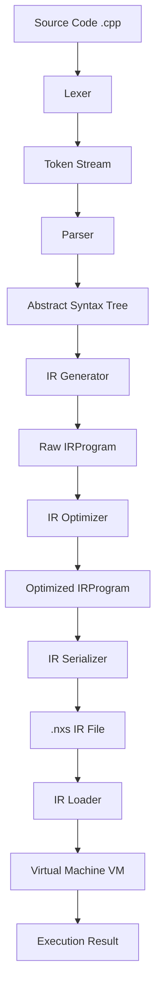

# NEXUS Toolchain Architecture Spec (v1.0.0)

This document provides a technical overview of the NEXUS compiler toolchain and virtual machine architecture.

## Overview

NEXUS is a deterministic compilation and virtual execution framework designed for a safe, register-based execution model. The framework consists of a frontend (Lexer & Parser), intermediate representation (IR) serialization, an IR loader, a runtime VM (interpreting register-based bytecode), and an optimizer.

## Compiler Frontend

### Lexer
- Tokenizes support syntax.
- Tracks exact line and column numbers.
- Groups keywords, identifiers, numeric literals, operators, and delimiters.
- Halts and returns lexical errors mapped under `[NX-1XX]`.

### Parser
- Implements a recursive descent parser.
- Ensures correct operator precedence and associativity (e.g. `*` binds tighter than `+`).
- Verifies nested blocks, functions, loops, and conditions.
- Rejects unsupported syntax (e.g., classes, templates, exceptions) using specific checks mapped under `[NX-2XX]` errors.

## Intermediate Representation (IR)

NEXUS uses a register-based intermediate representation designed to facilitate constant folding and dead code elimination:
- Memory: `ALLOCA`, `LOAD`, `STORE`, `CONST`
- Arithmetic: `ADD`, `SUB`, `MUL`, `DIV`, `MOD`
- Comparison: `EQ`, `NE`, `LT`, `LE`, `GT`, `GE`
- Control Flow: `BR`, `CBR`, `LABEL`
- Functions: `CALL`, `RET`
- Runtime: `PRINT`

## IR Optimizer

A JIT/AOT optimization layer:
- **Constant Folding**: Translates operations on constants into single constant expressions.
- **Dead Code Elimination (DCE)**: Recursively removes instructions defining registers that are never referenced, omitting instructions with side effects.

## Runtime Virtual Machine

A register-based VM executing stack frames:
- **Stack Frame**: Contains local variables (mapped via `alloca`), virtual registers, function pointers, and instruction pointers.
- **Diagnostics**: Standardized `[NX-4XX]` runtime error reporting checks for divisions by zero, invalid registers/labels, stack overflow/underflow, and invalid file handles.
- **Standard Library**: Supports file system handles, absolute math functions, powers, sleep timers, and console print.
